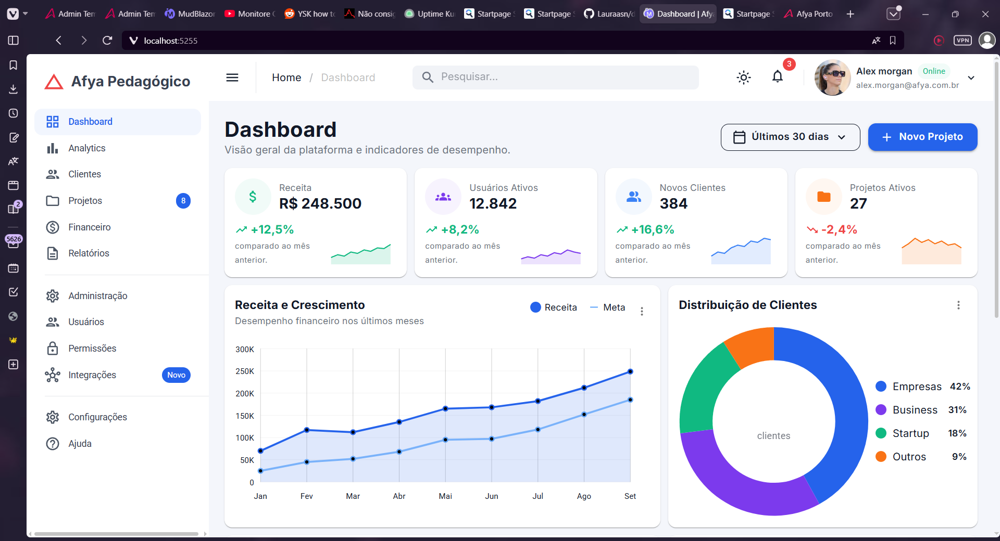
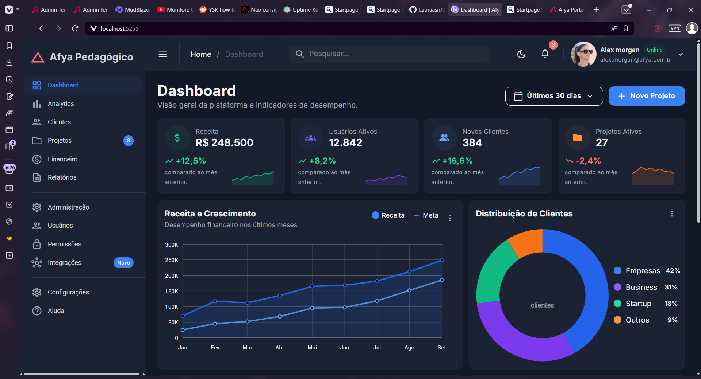
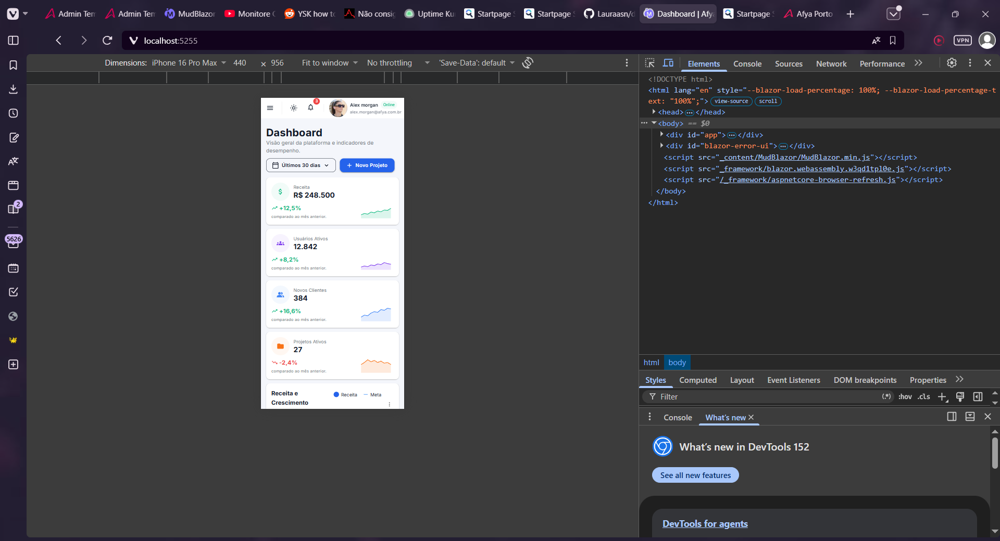
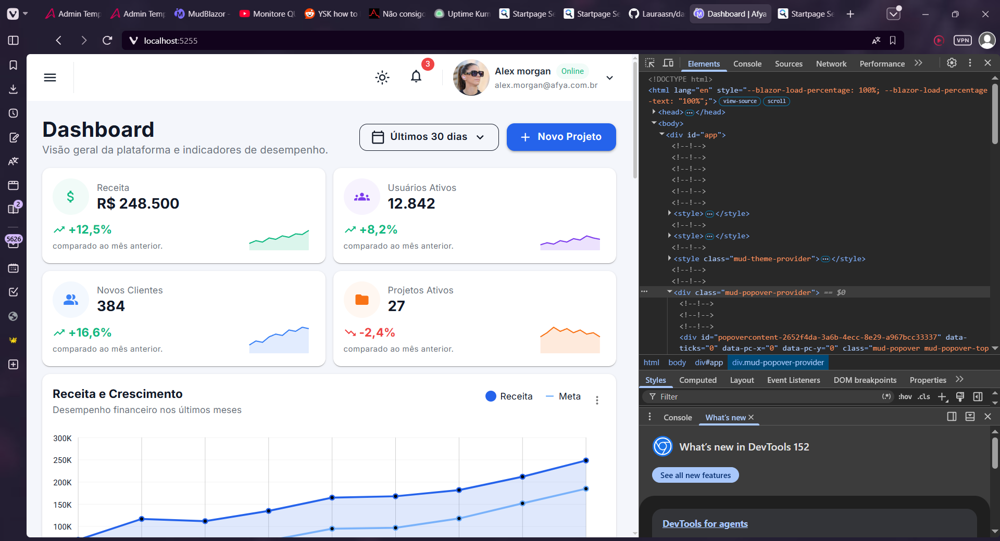

# Afya Admin — Dashboard com Blazor WebAssembly e MudBlazor

## Identificação

| | |
|---|---|
| **Aluno(a)** | Laura Artemes de Sousa Nunes |
| **Matrícula** | 2659344 |
| **Faculdade** | Centro Universitário Afya |
| **Curso** | Ciência da Compuação |
| **Disciplina** | Programação para Sistemas Web |
| **Professor(a)** | Profº. Me. Liluyoud Cury de Lacerda |
| **Semestre** | 2026.2 |

## Objetivo do projeto

O objetivo é praticar o que aprendemos ao longo do tempo em um projeto real, desenvolvendo uma aplicação web com Blazor WebAssembly e MudBlazor.
Além de entender melhor como cada parte realmente funciona, com a mão na massa,não se forma um bom profissional na área de TI somente com o conhecimento da teoria.

## Tecnologias utilizadas

- .NET 10 / Blazor WebAssembly
- MudBlazor 9

## Como executar

Passo a passo para clonar e rodar o projeto:

```bash
git clone https://github.com/seu-usuario/afya-admin.git
cd afya-admin
dotnet watch
```

A versão do .NET SDK necessária é a 10.0.401.

## Telas

### Tema claro


### Tema escuro


### Versão mobile


### HTML gerado (DevTools)


## Estrutura do projeto

afya-admin/
├── .docs/
│ ├── page_specification.md
│ └── tutorial.md
├── Components/
│ ├── AtividadesRecentes.razor
│ ├── CabecalhoPagina.razor
│ ├── DashboardCard.razor
│ ├── GraficoDistribuicaoClientes.razor
│ ├── GraficoReceita.razor
│ ├── KpiCard.razor
│ ├── PerformanceProjetos.razor
│ ├── ProjetosRecentes.razor
│ ├── SeletorPeriodo.razor
│ └── Ui.cs
├── Data/
│ └── DashboardData.cs
├── Layout/
│ ├── MainLayout.razor
│ └── NavMenu.razor
├── Pages/
│ ├── Dashboard.razor
│ └── NotFound.razor
├── Properties/launchSettings.json
├── wwwroot/
│ ├── css/app.css
│ ├── img/alex-morgan.jpg
│ ├── favicon.png, icon-192.png
│ └── index.html
├── _Imports.razor
├── afya-admin.csproj
├── App.razor
└── Program.cs


## Dificuldades e soluções

No DashboardData.cs, criei uma classe "Períodos", com um acento, mas me referi a essa classe como "Periodos" sem acento no Dashboard. Isso causou um conflito que impediu a aplicação de compilar com sucesso. Os erros indicaram que tinha algo errado com essa palavra, mas demorei para notar o que foi exatamente que aconteceu. Assim que notei, apenas removi o acento da classe em DashboardData.cs e deu tudo certo.